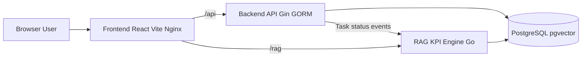
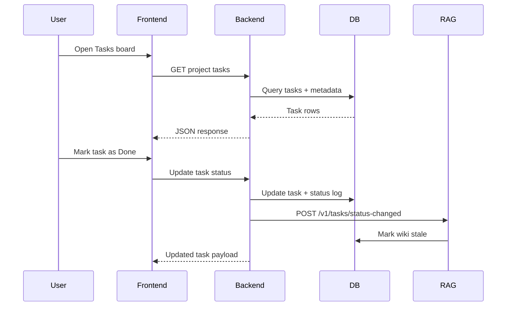
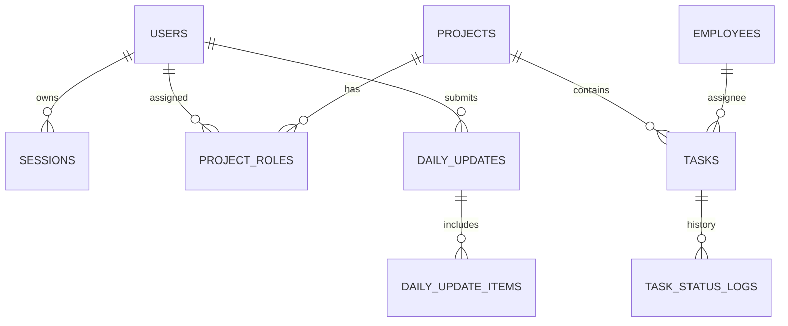

# OMS2 Project Hub

OMS2 is an SRS-aligned workspace for execution tracking, daily updates, KPI reporting, and RAG-assisted knowledge retrieval.

## Live URLs

- Frontend: https://attachment-project-vivasoft.onrender.com
- Backend health: https://vivasoft-oms-project-1.onrender.com/health
- RAG health: https://vivasoft-oms-project.onrender.com/health

## Animated Buttons

<div align="center">
  <a href="./docker-compose.yml"></a>
  <a href="#system-architecture"></a>
</div>

<div align="center">
  <a href="./frontend/README.md"></a>
  <a href="./backend/README.md"></a>
</div>

<div align="center">
  <a href="./rag-kpi-engine/README.md"></a>
  <a href="./backend/scripts/seed_demo_srs.sql"></a>
</div>

If your preview engine blocks SVG animation, the buttons remain fully clickable as regular links.

## Product Snapshot

- Role-aware project management with RBAC and system roles.
- Task lifecycle tracking with status history and daily updates.
- KPI intelligence computed from RAG signals and operational data.
- AI Wiki with semantic search across tasks, updates, and generated knowledge.
- Demo seed data for walkthrough-ready dashboards.

## Reference Docs

- SRS PDF: [docs/AI_PM_SRS_Final.pdf](docs/AI_PM_SRS_Final.pdf)
- Team Guidelines: [docs/Guidelines.md](docs/Guidelines.md)

## Quick Start (Docker)

```bash
docker compose up --build
```

Open:

- http://localhost:3000
- http://localhost:8081/health
- http://localhost:8085/health

Seed demo data (idempotent):

```powershell
Get-Content -Raw .\backend\scripts\seed_demo_srs.sql | docker exec -i oms2-postgres psql -U postgres -d oms2
```

Demo credentials (password: `password`):

- superadmin@oms2.local
- admin@oms2.local
- manager@oms2.local
- demo.employee.01@oms2.local

## System Architecture



## Request and Data Flow



## Domain Map



## Walkthrough Flow

1. Sign in as `superadmin@oms2.local`.
2. Review Dashboard KPI strip and project snapshot.
3. Open Projects -> Project Details -> Tasks board.
4. Update a task status to trigger RAG wiki stale mark.
5. Visit AI Wiki and search across project knowledge.
6. Check KPI screen after computation is available.
