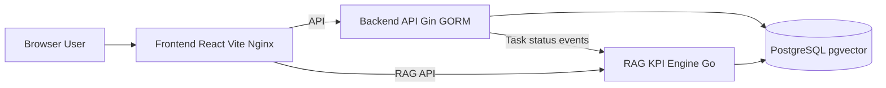
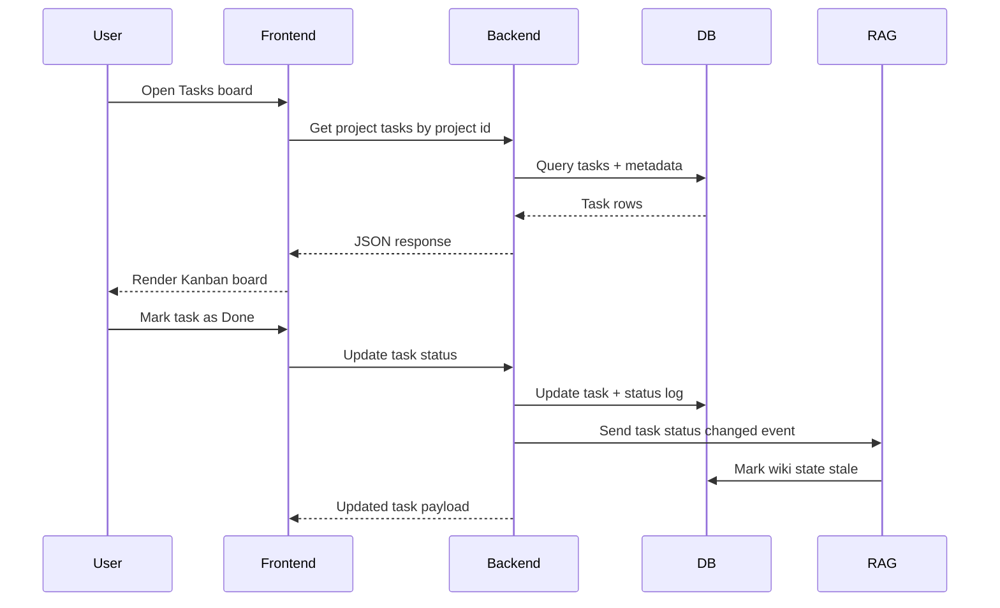
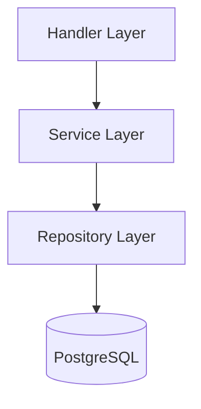
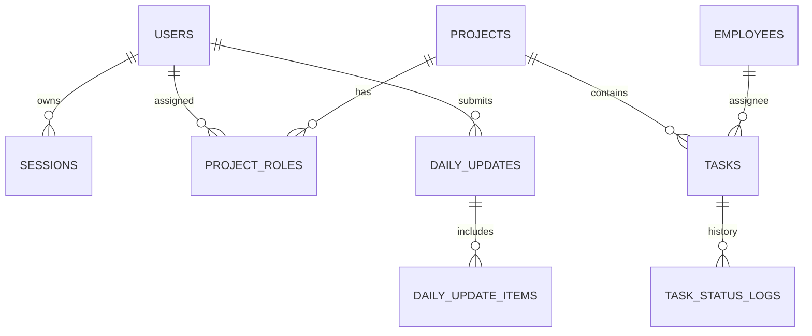

# OMS2: Office Management + RAG KPI Platform

OMS2 is a full-stack demo workspace for project execution tracking, daily updates, and RAG-powered insights.

## Live URLs

- Frontend: https://attachment-project-vivasoft.onrender.com
- Backend health: https://vivasoft-oms-project-1.onrender.com/health
- RAG health: https://vivasoft-oms-project.onrender.com/health

## Quick Links

<div align="center">
  <a href="./docker-compose.yml"></a>
  <a href="#system-architecture"></a>
</div>

<div align="center">
  <a href="./backend/README.md"></a>
  <a href="./frontend/README.md"></a>
</div>

<div align="center">
  <a href="./rag-kpi-engine/README.md"></a>
  <a href="./backend/scripts/seed_demo_srs.sql"></a>
</div>

If your preview engine blocks SVG animation, the buttons remain fully clickable as regular links.

## Demo Snapshot

- Jira-inspired UX shell with role-aware navigation.
- Seeded projects, tasks, and employees for walkthroughs.
- Daily updates and compliance-ready data.
- RAG wiki + KPI endpoints wired into the product flow.

## Quick Start (Docker)

1. From repository root, build and start all services:

```bash
docker compose up --build
```

2. Open:

- Frontend: http://localhost:3000
- Backend health: http://localhost:8081/health
- RAG health: http://localhost:8085/health

3. Seed deterministic demo data (idempotent, safe to re-run):

```powershell
Get-Content -Raw .\backend\scripts\seed_demo_srs.sql | docker exec -i oms2-postgres psql -U postgres -d oms2
```

4. Login credentials (all use password `password`):

- superadmin@oms2.local
- admin@oms2.local
- manager@oms2.local
- demo.employee.01@oms2.local

## System Architecture



### Request and Data Flow



### Backend Layered Design



### Core Data Model


