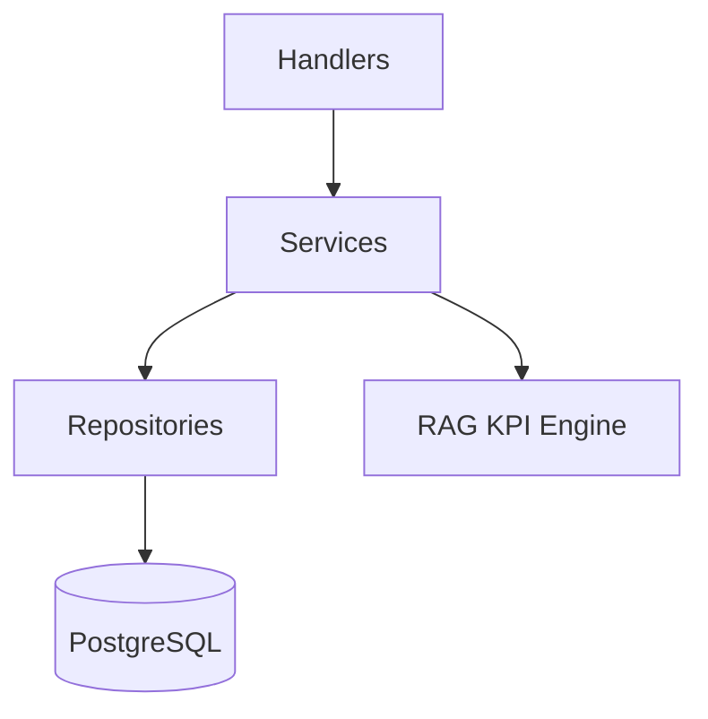

# OMS2 Backend API

Go + Gin API for auth, RBAC, projects, tasks, employees, and daily updates.

## Live URL

- Health: https://vivasoft-oms-project-1.onrender.com/health

## Animated Buttons

<div align="center">
  <a href="../README.md"></a>
  <a href="../backend/scripts/seed_demo_srs.sql"></a>
</div>

## Architecture



## Domain Modules

- Auth and sessions with JWT.
- RBAC for system + project roles.
- Employees, projects, tasks, and task status history.
- Daily updates and compliance reporting.

## Core Routes

- Auth: `/api/v1/auth/login`, `/api/v1/auth/me`, `/api/v1/auth/logout`
- Users/Roles: `/api/v1/users`, `/api/v1/roles`
- Employees: `/api/v1/employees`
- Projects: `/api/v1/projects`, `/api/v1/projects/:project_id/roles`
- Tasks: `/api/v1/projects/:project_id/tasks`, `/api/v1/tasks/:id/status`, `/api/v1/tasks/:id/history`
- Daily updates: `/api/v1/daily-updates`, `/api/v1/daily-updates/compliance`

## Local Development

```bash
go mod tidy
go run cmd/server/main.go
```

Default URL: http://localhost:8081

## Environment Variables

```
ENV=development
SERVER_HOST=0.0.0.0
SERVER_PORT=8081
DB_HOST=localhost
DB_PORT=5432
DB_NAME=oms2
DB_USER=postgres
DB_PASSWORD=postgres
DB_SSLMODE=disable
JWT_SECRET_KEY=change_me
JWT_EXPIRY_HOURS=24
RAG_ENGINE_URL=http://localhost:8085
```

## Seed Demo Data

```bash
docker exec -i oms2-postgres psql -U postgres -d oms2 < backend/scripts/seed_demo_srs.sql
```

## Health Check

```bash
curl http://localhost:8081/health
```

## Reference Docs

- SRS PDF: [../docs/AI_PM_SRS_Final.pdf](../docs/AI_PM_SRS_Final.pdf)
- Team Guidelines: [../docs/Guidelines.md](../docs/Guidelines.md)
