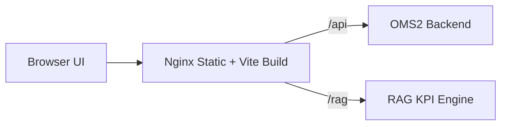

# OMS2 Frontend

React + TypeScript UI for the OMS2 Project Hub.

## Live URL

- https://attachment-project-vivasoft.onrender.com

## Animated Buttons

<div align="center">
  <a href="https://attachment-project-vivasoft.onrender.com">
    
  </a>
  <a href="../README.md#system-architecture">
    
  </a>
</div>

## Frontend Architecture



## UX Surfaces

- Dashboard: KPI strip, portfolio snapshot, daily pulse cards.
- Projects: metadata, members, and live task board.
- Tasks: kanban swimlanes, status history, assignee insights.
- Daily Updates: compliance timeline, notes, and status checks.
- KPI: AI-assisted score summaries and component breakdown.
- AI Wiki: grounded search across tasks and updates.

## Local Development

```bash
npm install
npm run dev
```

Open http://localhost:3000

## Environment Variables

```
VITE_API_URL=/api/v1
VITE_RAG_API_URL=/rag/v1
```

These values are relative because Nginx proxies `/api` and `/rag` to the backend and RAG services.

## Build

```bash
npm run build
```

## Demo Credentials

- superadmin@oms2.local / password
- admin@oms2.local / password
- demo.employee.01@oms2.local / password

## Reference Docs

- SRS PDF: [../docs/AI_PM_SRS_Final.pdf](../docs/AI_PM_SRS_Final.pdf)
- Team Guidelines: [../docs/Guidelines.md](../docs/Guidelines.md)
