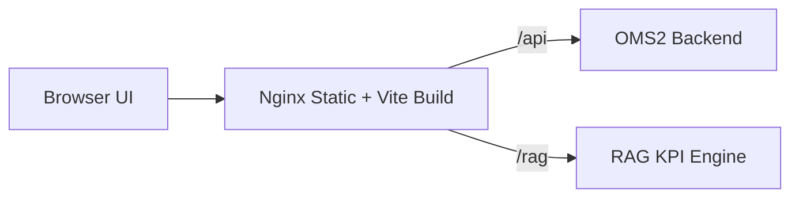

# OMS2 Frontend

React + TypeScript UI for the OMS2 Project Hub.

## Live URL

- https://attachment-project-vivasoft.onrender.com

## Animated Launch Buttons

<div align="center">
  <a href="https://attachment-project-vivasoft.onrender.com">
    <defs><linearGradient id='g' x1='0' x2='1'><stop offset='0' stop-color='%232874f0'/><stop offset='1' stop-color='%230ea5a2'/></linearGradient></defs><rect x='1' y='1' width='258' height='46' rx='23' fill='url(%23g)'/><circle cx='24' cy='24' r='6' fill='%23ffffff'><animate attributeName='r' values='6;9;6' dur='2.6s' repeatCount='indefinite'/></circle><text x='72' y='30' font-size='15' fill='%23ffffff' font-family='Arial' font-weight='700'>Open Live App</text></svg>" alt="Open Live App" />
  </a>
</div>

## Frontend Architecture



## Local Development

```bash
npm install
npm run dev
```

Open http://localhost:3000

## Environment Variables

```
VITE_API_URL=/api/v1
VITE_RAG_API_URL=/rag/v1
```

These values are relative because Nginx proxies `/api` and `/rag` to the backend and RAG services.

## Build

```bash
npm run build
```

## Demo Credentials

- superadmin@oms2.local / password
- admin@oms2.local / password
- demo.employee.01@oms2.local / password
